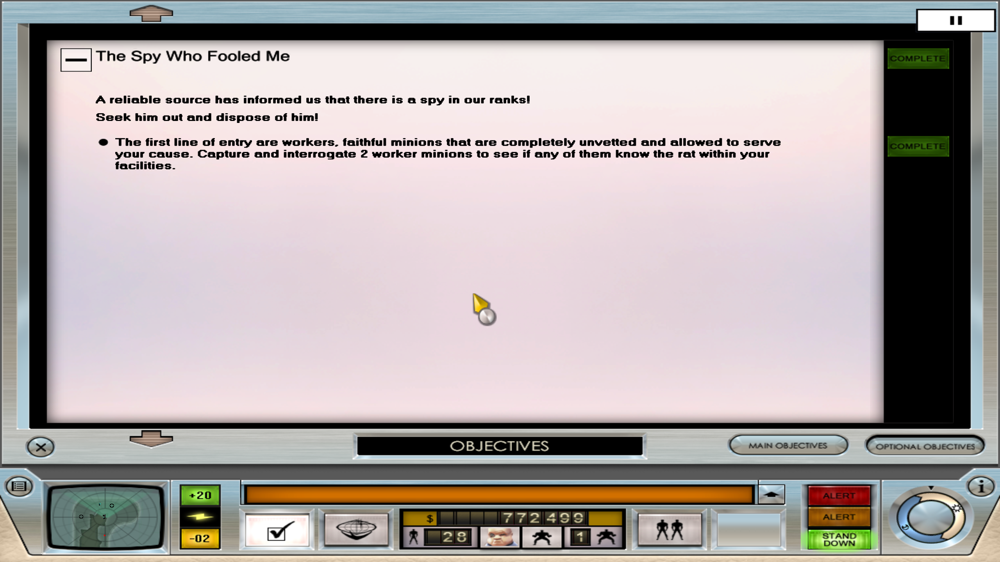

# Basic instructions for creating new objectives

The main logic of your objectives will be controlled in an ATN network, in which triggers and other special events can be configured to desired effects. To hook your new objective to start automatically, you can add a new thread to "Island One - MAIN" or "Island Two - MAIN" that starts your objective without risking conflicts with any other mod. It's recommended to use a dummy "launcher" network that has no parameters or input resources, which in turn actually starts your objective network. This way, you can use the effect "5699: ATN: Run Game Rule" to ensure that your network launcher is run in parallel and won't be terminated when the "MAIN" network is terminated. Just remember to terminate this thread so you won't cause any other issues.

For objective strings, it is recommended to use the prefix `OBJECTIVE_` to make the ATN Editor recognize them as Objective IDs. Moreover, it can be recommended to avoid following the base game's naming scheme of e.g. `OBJECTIVE_17_*` as the main prefix, and instead use a main prefix less likely to collide with another mod as new strings are currently not made unique by the Mod Manager. For instance, `OBJECTIVE_SPY_FOOLED_*` would be better for an objective titled "The Spy Who Fooled Me" than `OBJECTIVE_18_*`. Similarly, you can opt to do the same when adding new string files to avoid any collisions with other mods - however, the Mod Manager will still perform delta patching even if mods use the same string files. The worst thing that could happen is that wrong strings are displayed due to collisions.

To add subobjectives to your objective, you simply specify the parent Objective ID in "5697: Objective: Set Status", with `UNDEFINED` specifying that it is a topmost objective. For topmost objectives, there should be an XML-file with a description of what it's about as the base game's objectives. If this is not included, your subobjectives will not be seen on the same page as the objective header, which will be confusing for any players. To add a description, you simply create a new XML file following the format of the base game in `LResource/ObjectiveDetails` and add a matching entry to `DynamicResources/Config/ObjectiveDetails.ini`. Note that it's best to include `ObjectiveDetails.ini` in your main mod folder to allow the Mod Manager to merge this file so that multiple mods can use it. Moreover, you can also add XML descriptions for any subobjectives and use `ObjectiveDetails.ini` to add progress bar elements.

With all this setup, you now have the basics set and can inspect how the base game objectives work to design your own objective.
